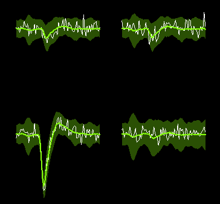

# Amplitudes and amplitudes and amplitudes

SpikeInterface allows you to compute `spike amplitudes` and `amplitude scalings`. Kilosort4 outputs a file called `amplitudes.npy`. What are these? Are they related? Which one is "best"? Let's find out.

## What's a spike amplitude?

On any probe more compicated than a single electode, every spike you detect can be seen on several channels. Here's an example from a 4-channel recording

Some quick definitions:

- The green line is the **average waveform** of the unit. 
- The white line is taken from the raw data after preprocessing: we call this the **waveform**.
- Each spike has a **spike time**, determined by the spike sorted you use.
- There is one channel where the signal is largest, according to the average waveform. This is called the **extremum channel** for that unit.

So, what is this spike's amplitude? There are actually a bunch of reasonable answers. Here are a few

1. The absmax of the waveform
2. The absmax of the waveform on the extremum channels
3. The difference between the max and min of the waveform (either on all channels, or the extremum channel)
4. The value of the waveform at the spike time, on the extremum channel
5. Something the sorter computes during spike sorting

The last option sounds good, but unfortunately not all spike sorters store their estimation of the spike amplitude. In SpikeInterface, we want our methods to work with all sorters, so won't pick that (although we'll see later that you can grab amplitudes from sorters if you want!).

In SpikeInterface, our default is definition 4., mostly because it is very fast. But, alas, it is quite noisy. The spike time doesn't always perfectly match the max. And you're looking at a single point, rather than the full waveform. So bits of noise are more likely to have a big effect. In fact, methods 1-4 above all rely on the waveform at a single point (e.g. the value at the absmax), which makes them intrinsically noisy.

## Amplitude scalings

Instead of relying on the signal at one point, we can use the whole waveform. When we compute amplitude scalings, we ask: what scaling factor do we need to apply to the template to best match the waveform? You can do this by using a linear regression which compares all points of the waveform to all points of the template. 

At the end, you get a scaling factor out, but we can convert to `uV` by multiplying the result by inverting it (to get the factor you need to apply to the waveform to get the template) then multiplying by the absmax of the template. Once you do this, you can compare the outputs of the spike amplitudes and the amplitude scalings. Let's take a look on some real Neuropixels data sorted with Kilosort4.
